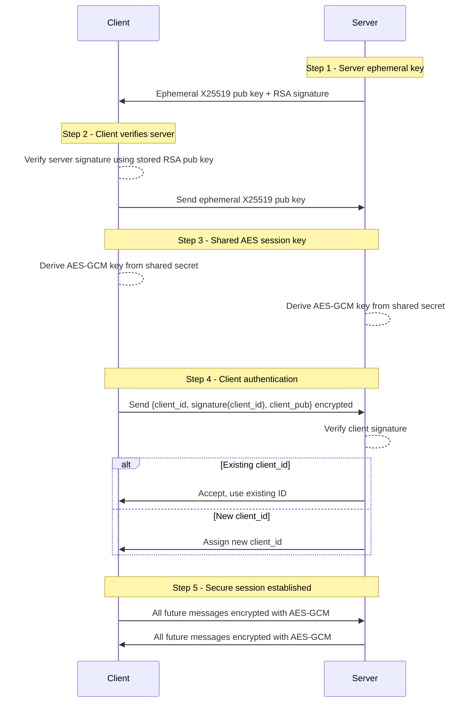

# SchiedChat 🛡️

**SchiedChat** is a secure chat system built on WebSockets, using **AES-GCM 256-bit encryption** for messages and RSA authentication. The server acts as a relay between clients, ensuring confidentiality  

---

## 🔒 Features

- **Secure messaging** with AES-GCM 256-bit (confidentiality + authenticity).  
- **RSA + ephemeral X25519 handshake** between client and server.  
- **Persistent public key registry**: each client has a **unique `client_id` UUID** and a public key stored on the server.  
- **Challenge-response** prevents impersonation of offline clients.  
- **No message logging**: messages are never stored on the server.  
- **Secure message forwarding** between clients.  
- **Supports multiple simultaneous clients**.  
- **No phone required**: clients only use a randomly generated `client_id`, which can be changed if needed.

---

## 🛡️ Security
- **AES-GCM 256-bit encryption** for message confidentiality and authenticity.  
- **RSA + ephemeral X25519 handshake** ensures secure client-server authentication.  
- **Persistent public key registry** links each `client_id` to its public key, preventing impersonation.  
- **Challenge-response mechanism**: clients must prove ownership of their private key before the server accepts the connection.  
- **Client IDs (`client_id`)**: each client is uniquely identified; the server enforces that only the legitimate owner can use that ID.  
- **Nonces + session AES keys** prevent replay attacks.  
- **No logging**: messages are never stored on the server.  
- **Multi-client safe**: isolated sessions prevent message leakage between clients.
- 
---

## 🚀 Installation
```bash
git clone https://github.com/tuo-username/SchiedChat.git
cd SchiedChat
pip install -r requirements.txt
```


## ⚡ Use
### 🖥️ Server
1. **Configure the server**  
- Edit the **host** and **port** in the configuration file if needed.

2. **Start the server**  
```bash
cd server
python3 main.py
```
3. **✅ The server is now listening and ready to accept client connections.**

### 💻 Client
1. **Configure the client**  
- Make sure the **host** and **port** match the server settings.
2. **Start the client**  
```bash
cd client
python3 main.py
```
3. **Connect to another client**  
 Enter the **ID of the client** you want to chat with.
4. **Chat securely!**  


## 🔑 Handshake & Client Authentication Flow


